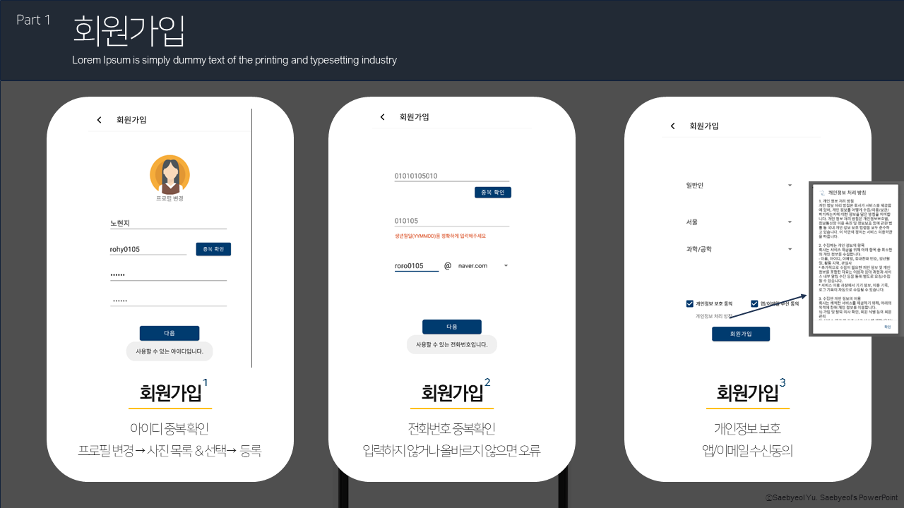

# Would-you
### 공모전 팀 모집 커뮤니티 어플 

## ▶ 프로젝트 기간  
  2021.02.04 - 2021.02.14 (10 Days) 
      

## ▶ 프로젝트 소개
<b>'팀원 한 사람 한 사람이 별이고, 별이 모여 팀을 이루고, 그 팀들이 모여 우주를 이룬다'</b>의 뜻을 지닌 <b>'Would you'</b> 서비스는 <u>공모전 팀 모집 주 기능으로 한 안드로이드 어플</u>이다.  
- <b> 공모전 정보 제공 및 추천</b>:  
 회원 기반으로 운영되는 'Would you' 어플에서 사용자는 공모전 정보를 확인하고 관심사에 맞는 공모전을 추천받을 수 있다.  
 
- <b> 팀 생성 및 팀원 신청</b>:  
사용자는 원하는 공모전에 팀을 생성할 수 있으며, 이미 만들어진 팀에 팀원으로 신청할 수 있는 기능이 있다. 
  - 팀원으로 신청 시에는, 해당 사용자의 공모전 경력 정보와 지원자 정보가 팀장에게 공유된다.  
  
- <b> 팀 관리 </b>:   
'팀 관리' 기능은 팀장만 접근 가능하며, 팀원 신청 목록에서 신청된 사용자들을 승인/거절/미정으로 바꿀 수 있다.

- <b> 개인페이지</b>:  
 개인페이지에서는 '만든 팀', '신청 목록', '경력', '관심 목록'을 탭 레이아웃으로 확인할 수 있다. 그 외에도 프로필 변경, 로그아웃, 개발자 문의, 회원 탈퇴 기능이 있다.  
   

## ▶ 팀원 
2021 Guru2 Final Project  
- [김혜민 (HyeM207)](https://github.com/HyeM207)  
- [우가연 (woogy4231)](https://github.com/woogy4231)  
- [임정수 (JJ503)](https://github.com/JJ503)  
    

## ▶ 세부 기능 설명
### #1. 로그인 및 ID/PW 변경

### #2. 회원가입

  

### #3. 메인페이지

  

### #4. 공모전&팀 목록 페이지

  

### #5. 공모전 상세 페이지

  

### #6. 팀 상세 페이지

  

### #7. 팀 생성/신청 페이지

  

### #8. 개인 페이지 (메인, 설정)

  

### #9. 개인 페이지 (만든 팀)

  

### #10. 개인 페이지 (메뉴)

  
